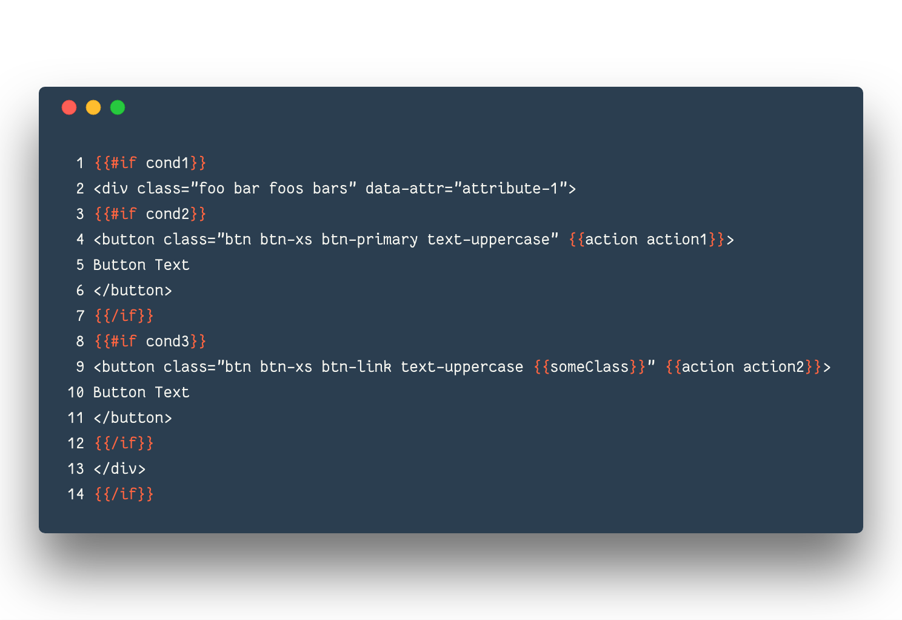
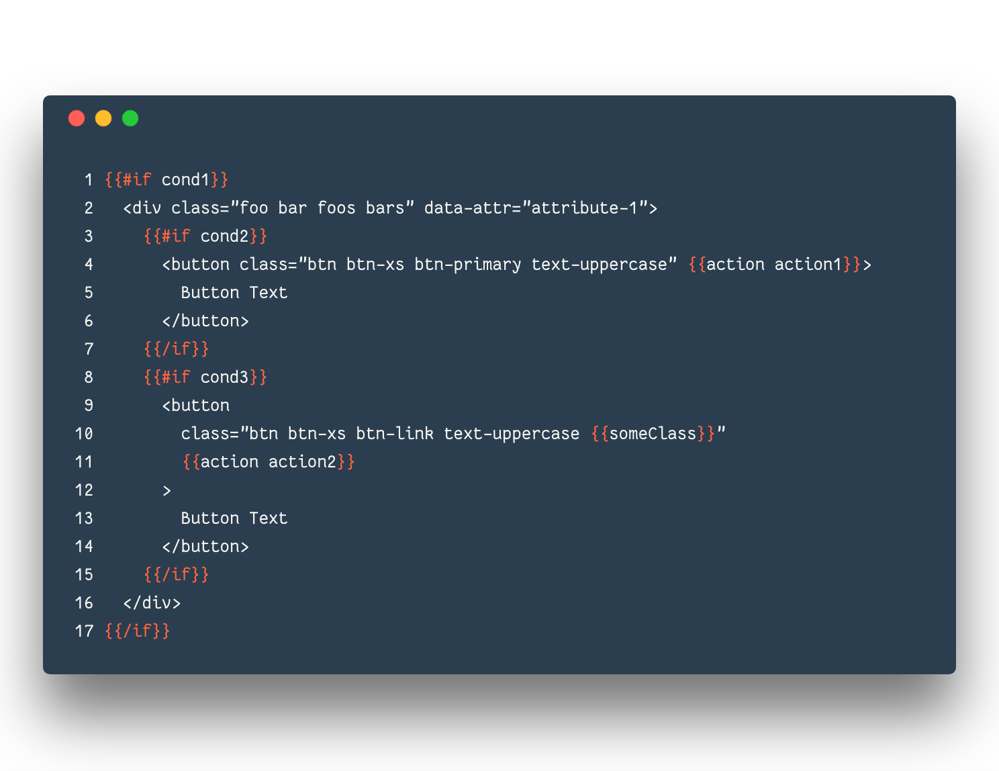

# beautify-handlbars

https://travis-ci.org/kandhavivekraj/beautify-handlebars.svg?branch=master

Beautify your handlebars/mustache, using prettier.

Here is the Unformatted code

Press `cmd-shift-b`, then the formatted code will be,

**Usage**

_Keybindings_

By default is uses `cmd-shift-b` to beautify your handlebars.

You can change the config

you can customize these in the Atom keymap.cson (`Atom -> Keymap..`):

**Installation**
  - In Atom, go to Settings (cmd-,) -> Install -> Search Beautify handlbars
  - Or, run apm install beautify-handlbars

**Contributing**
  - Your contributions are really appreciated or raise an [issue](https://github.com/kandhavivekraj/beautify-handlebars/issues)
