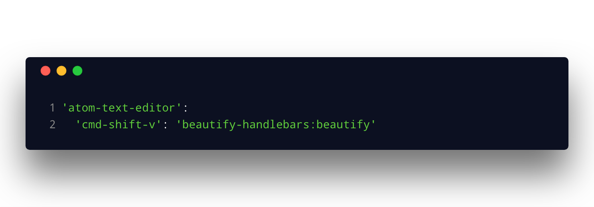

# beautify-handlebars

 

Beautify your handlebars/mustache fiels, using Prettier.

Before:

To format, use the keyboard shortcut `cmd-shift-b`,

After:

**Usage**

_Keybindings_

By default it uses `cmd-shift-b` to beautify your handlebars.

you can customize these in the Atom's keymap.cson (`Atom -> Keymap..`)

**Installation**
  - In Atom, go to Settings (`cmd-,`) -> Install -> Search Beautify handlebars
  - Or, run `apm install beautify-handlebars`

### Settings

##### Line Length
  Set `Settings -> Editor -> Preferred Line Length` to Soft Wrap.

##### Indent using tab or space
  - If you want to indent using tabs, set `Settings -> Editor -> Tab Type` as `hard`
  - If you want to indent using spaces, set `Settings -> Editor -> Tab Type` as `soft`

> Note: If you set `Tab Type` as `auto` it will behave same as `soft`.

**Contributing**
  - Your contributions are really appreciated or raise an [issue](https://github.com/kandhavivekraj/beautify-handlebars/issues)
